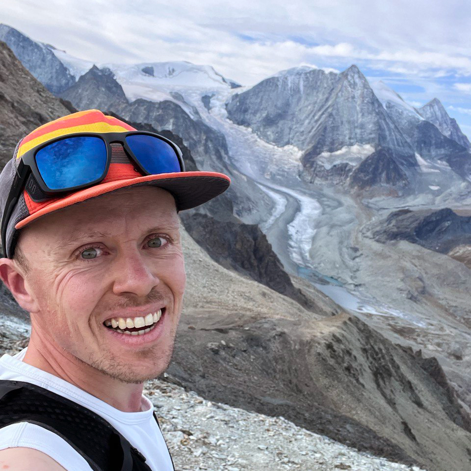

::: {.hero}
::: {.hero-content}

::: {.hero-image}
{.profile-photo}
:::

::: {.hero-text}

[Frédéric Montet]{.hero-name}

[Computer science researcher creating data solutions for nature and people. I am fascinated by movement, mountains and paragliding.]{.hero-tagline}

:::{.hero-ctas}

[Mail](mailto:simplelogin-newsletter.arrive061@simplelogin.com){.cta-link}

:::
:::
:::
:::

## Writing {#writing}

### Latest Stories

::: {#all-stories}
:::

[All stories](stories.qmd){.cta-link}

## Research {#research}

### Focus Areas

My academic work focuses on **data science** applied to real-world problems for the benefit of our **environment** given four axes:

:::: {.research-grid}

::: {.research-card}
### Built Environment
Scalable building energy modeling and district heating network anomalies.
:::

::: {.research-card}
### Environmental Metrics
Measuring ecosystem health, change, and risk, from spatiotemporal data.
:::

::: {.research-card}
### Temporal Modeling
Time series analysis, advanced forecasting and pattern recognition.
:::

::: {.research-card}
### Spatial Modeling
Geodata processing and modelling with raster, vector or photogrammetry. 
:::

::::

### Publications
Follow my work on [ORCID](https://orcid.org/0000-0003-0439-5559) and [Google Scholar](https://scholar.google.com/citations?hl=en&user=dCLgOOoAAAAJ&view_op=list_works&sortby=pubdate).

## Collaborations {#collaborations}

### Academic Mentorship

I was fortunate to be guided by the following professors:

- [Jean Hennebert](https://people.hes-so.ch/en/profile/198587651-jean-hennebert) from [HEIA-FR](https://www.heia-fr.ch) — PhD co-supervisor
- [Philippe Cudré-Mauroux](https://www.unifr.ch/directory/fr/people/10710/c0027) from [UNIFR](https://www.unifr.ch/) — PhD co-supervisor
- [Jean-Philippe Bacher](https://people.hes-so.ch/fr/profile/683897247-jean-philippe-bacher) from [HEIA-FR](https://www.heia-fr.ch) — Energy guidance
- [Marcus Liwicki](https://www.ltu.se/en/staff/m/marcus-liwicki) from [LTU](https://www.ltu.se/) — Host in Northern Sweden

## About {#about}

### Short Bio

My name is Fred Montet, I am a computer science researcher from Switzerland.

From an apprenticeship in mechatronics to a doctoral degree in computer science, my education enables me to understand practical problems and deliver pragmatic solutions.

Since 2015, I have run several self-employed ventures—from a small creative agency to paragliding tandem flights—to support my academic work. During this time, I collaborated with partners including Groupe E, Richemont, Raiffeisen and SBB; most Swiss-French cantons; as well as some start-ups and universities.

With the support of my professors, we co-created applied research projects involving multiple stakeholders and needs. In these projects, I coordinated the work of several scientific collaborators.

I admire work that demands design literacy, movement, and of course, most activities in mountains and nature.

[Read my CV](assets/fred-montet-cv.pdf){.cta-link download="fred-montet-cv.pdf"}

